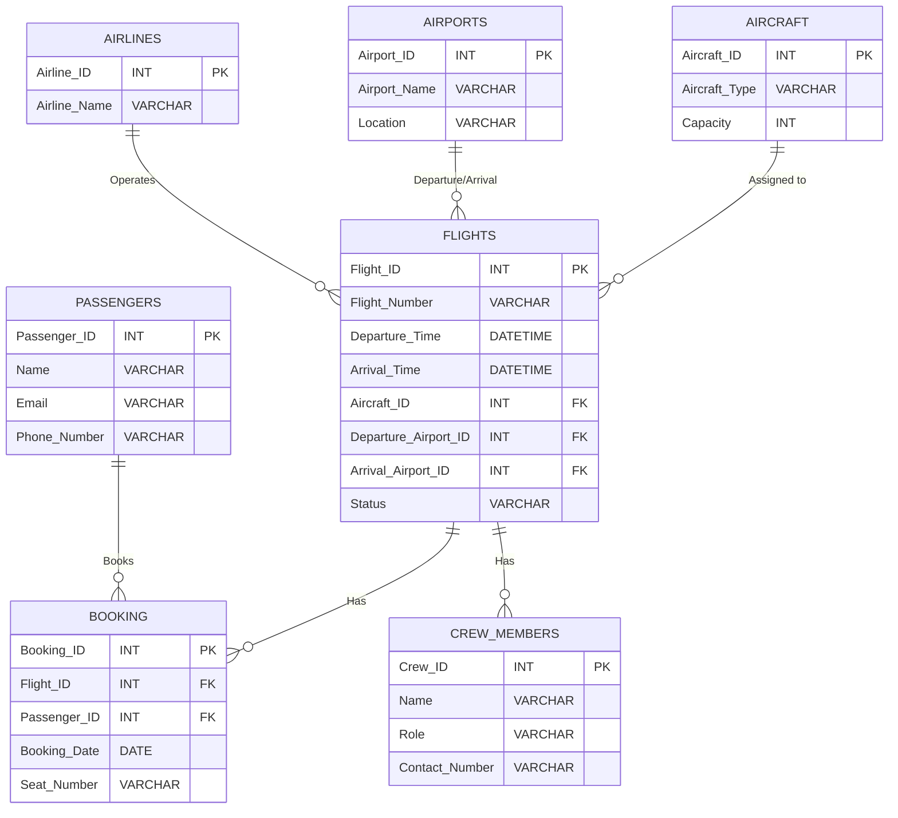

# SQL Project

This is the repo for the sql-project course
The course is in 4 part

- creating the database
    - designing the database
    - drawing the er Diagram
    - drawing the `dsd` Diagram
    - creating the creation script in `SQL`
    - creating the  drop script in `SQl`
    - add data to the database

## ERD Diagram

