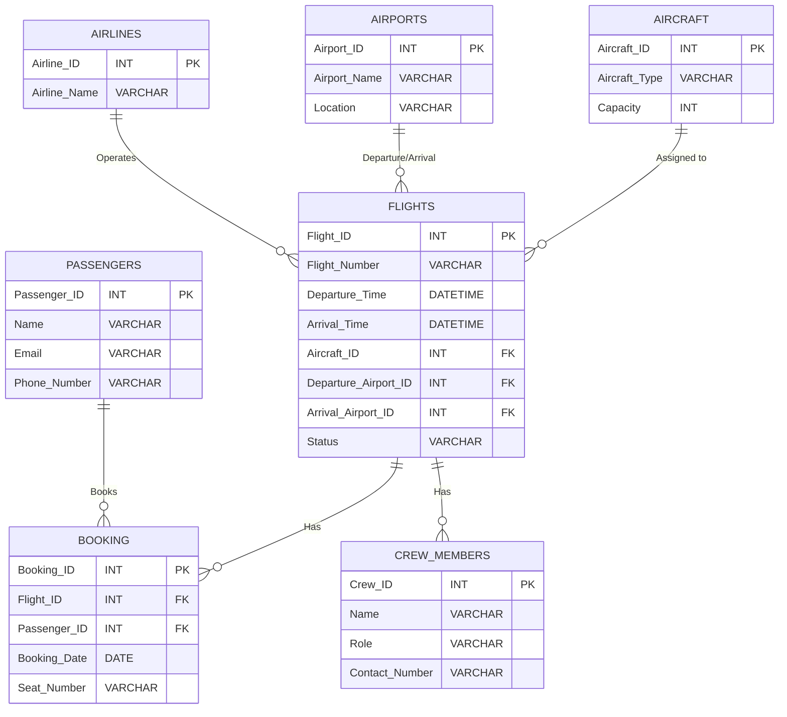

# Stage 1: Database Design and Implementation

## Implementation

### Enterprise: Airport

1. **Flights Management**
   - **Entities**: Flights, Airlines, Airports, Routes, Passengers, Crew Members, Aircraft, Flight Status, Booking

2. **Goods & Services Management**

   - **Entities**: Goods (e.g., luggage, cargo), Services (e.g., parking, catering), Inventory, Suppliers, Service Requests, Service Providers, Contracts

3. **User Management**
   - **Entities**: Users (e.g., passengers, staff), Roles, Permissions, Accounts, Customer Feedback, Customer Support, Employee Records, Training Records

> [!NOTE] This part is up to the other team, so we have no control over this

### Enterprise: Description

Our project focuses on emulating a part of an airport's database system. The database will manage various aspects of flight operations, passenger information, aircraft data, and more. This simulation aims to showcase the complexity and functionality required in a real-world airport setting.

The database will be designed to handle multiple entities such as flights, airlines, airports, passengers, crew members, aircraft, and bookings. Each entity plays a crucial role in the airport ecosystem, and the database will facilitate efficient management and interaction between these entities.

This project will help us understand and implement key database concepts such as entity-relationship modeling, normalization, and database management. It will also provide valuable experience in designing and implementing a database system for a complex real-world scenario.

### Schema & ERD

Sure! Here is a detailed description of the database design for the Flights Management system, incorporating the SQL script for table creation:

### Entities for Flights Management:

1. **Airlines**

   - **Attributes**:
     - Airline_ID (Primary Key): `INTEGER`
     - Airline_Name: `VARCHAR(100)`
   - **Strong Entity**: Yes
   - **Relationships**:
     - One-to-Many (1:M) with Flights

2. **Airports**

   - **Attributes**:
     - Airport_ID (Primary Key): `INTEGER`
     - Airport_Name: `VARCHAR(100)`
     - Location: `VARCHAR(100)`
   - **Strong Entity**: Yes
   - **Relationships**:
     - One-to-Many (1:M) with Flights (Departure_Airport and Arrival_Airport)

3. **Aircraft**

   - **Attributes**:
     - Aircraft_ID (Primary Key): `INTEGER`
     - Aircraft_Type: `VARCHAR(100)`
     - Capacity: `INTEGER`
   - **Strong Entity**: Yes
   - **Relationships**:
     - One-to-Many (1:M) with Flights

4. **Passengers**

   - **Attributes**:
     - Passenger_ID (Primary Key): `INTEGER`
     - Passenger_Name: `VARCHAR(100)`
     - Passenger_Phone: `VARCHAR(20)`
     - Passenger_Email: `VARCHAR(150)`
     - Passport_Number: `VARCHAR(100)`
     - Passenger_Age: `INTEGER`
   - **Strong Entity**: Yes
   - **Relationships**:
     - Many-to-Many (M:M) with Flights (through Booking)

5. **Flights**

   - **Attributes**:
     - Flight_ID (Primary Key): `INTEGER`
     - Flight_Number: `VARCHAR(15)`
     - Departure_Time: `DATE`
     - Arrival_Time: `DATE`
     - Departure_Airport: `INTEGER` (Foreign Key)
     - Arrival_Airport: `INTEGER` (Foreign Key)
     - Flight_Status: `VARCHAR(20)`
     - Aircraft_ID: `INTEGER` (Foreign Key)
     - Airport_ID: `INTEGER` (Foreign Key)
     - Airline_ID: `INTEGER` (Foreign Key)
   - **Strong Entity**: Yes
   - **Relationships**:
     - One-to-Many (1:M) with Aircraft
     - One-to-Many (1:M) with Airports (Departure and Arrival)
     - One-to-Many (1:M) with CrewMembers
     - Many-to-Many (M:M) with Passengers (through Booking)

6. **Booking**

   - **Attributes**:
     - Booking_ID (Primary Key): `INTEGER`
     - Seat_Number: `VARCHAR(10)`
     - Booking_Date: `DATE`
     - Passenger_ID: `INTEGER` (Foreign Key)
     - Flight_ID: `INTEGER` (Foreign Key)
   - **Weak Entity**: Yes
     - **Reason**: Booking has no meaning by itself; it has meaning only when attached to a specific flight and passenger.
   - **Relationships**:
     - Many-to-Many (M:M) with Passengers
     - Many-to-Many (M:M) with Flights

7. **CrewMembers**
   - **Attributes**:
     - Crew_ID (Primary Key): `INTEGER`
     - Crew_Name: `VARCHAR(100)`
     - Crew_Role: `VARCHAR(50)`
     - Flight_ID: `INTEGER` (Foreign Key)
   - **Strong Entity**: Yes
   - **Relationships**:
     - One-to-Many (1:M) with Flights

## Database Normal Form

### Normalization Explanation

Our database schema for the Flights Management system is normalized to the Third Normal Form (`3NF`). Each table has been carefully designed to ensure that all non-key attributes are fully dependent on the primary key and not on any other non-key attribute, thereby eliminating any transitive dependencies. This design ensures that our schema is free from redundancy and potential update anomalies, leading to more efficient and reliable data management.

#### Detailed Explanation:

1. **Airlines**

   - Primary Key: `Airline_ID`
   - Non-key attributes (`Airline_Name`) are fully dependent on the primary key and do not depend on each other.

2. **Airports**

   - Primary Key: `Airport_ID`
   - Non-key attributes (`Airport_Name`, `Location`) are fully dependent on the primary key and do not depend on each other.

3. **Aircraft**

   - Primary Key: `Aircraft_ID`
   - Non-key attributes (`Aircraft_Type`, `Capacity`) are fully dependent on the primary key and do not depend on each other.

4. **Passengers**

   - Primary Key: `Passenger_ID`
   - Non-key attributes (`Passenger_Name`, `Passenger_Phone`, `Passenger_Email`, `Passport_Number`, `Passenger_Age`) are fully dependent on the primary key and do not depend on each other.

5. **Flights**

   - Primary Key: `Flight_ID`
   - Non-key attributes (`Flight_Number`, `Departure_Time`, `Arrival_Time`, `Departure_Airport`, `Arrival_Airport`, `Flight_Status`, `Aircraft_ID`, `Airline_ID`) are fully dependent on the primary key and do not depend on each other.

6. **Booking**

   - Composite Primary Key: (`Booking_ID`, `Passenger_ID`, `Flight_ID`)
   - Non-key attributes (`Seat_Number`, `Booking_Date`) are fully dependent on the composite primary key and do not depend on each other.

7. **CrewMembers**
   - Primary Key: `Crew_ID`
   - Non-key attributes (`Crew_Name`, `Crew_Role`, `Flight_ID`) are fully dependent on the primary key and do not depend on each other.

### ERD Diagram



#### DSD Diagram:

This diagram represents the relationships between the entities in the Flights Management part of the airport database system. Each entity is connected based on its relationship with other entities. If you need further adjustments or explanations, feel free to ask!


#### ER Diagram:


## SQL Code

### Creation script

This is the code that was generated using the `erdplus.com` tool and also making sure that the was no mistake in the code.

```sql
CREATE TABLE Airlines
(
  AIRLINE_ID INT NOT NULL,
  AIRLINE_NAME VARCHAR(100) NOT NULL,
  PRIMARY KEY (AIRLINE_ID)
);

CREATE TABLE Airports
(
  AIRPORT_ID INT NOT NULL,
  AIRPORT_NAME VARCHAR(10) NOT NULL,
  LOCATION VARCHAR(100) NOT NULL,
  PRIMARY KEY (AIRPORT_ID)
);

CREATE TABLE Aircraft
(
  AIRCRAFT_ID INT NOT NULL,
  AIRCRAFT_TYPE VARCHAR(100) NOT NULL,
  CAPACITY INT NOT NULL,
  PRIMARY KEY (AIRCRAFT_ID)
);

CREATE TABLE Passengers
(
  PASSENGER_ID INT NOT NULL,
  PASSENGER_NAME VARCHAR(100) NOT NULL,
  PASSENGER_PHONE VARCHAR(20) NOT NULL,
  PASSENGER_EMAIL VARCHAR(150) NOT NULL,
  PASSPORT_NUMBER VARCHAR(100) NOT NULL,
  PASSENGER_AGE INT NOT NULL,
  PRIMARY KEY (PASSENGER_ID)
);

CREATE TABLE Flights
(
  FLIGHT_ID INT NOT NULL,
  FLIGHT_NUMBER VARCHAR(15) NOT NULL,
  DEPARTURE_TIME DATE NOT NULL,
  ARRIVAL_TIME DATE NOT NULL,
  DEPARTURE_AIRPORT INT NOT NULL,
  ARRIVAL_AIRPORT INT NOT NULL,
  FLIGHT_STATUS VARCHAR(20) NOT NULL,
  AIRCRAFT_ID INT NOT NULL,
  AIRPORT_ID INT NOT NULL,
  AIRLINE_ID INT NOT NULL,
  PRIMARY KEY (FLIGHT_ID),
  FOREIGN KEY (AIRCRAFT_ID) REFERENCES Aircraft(AIRCRAFT_ID),
  FOREIGN KEY (AIRPORT_ID) REFERENCES Airports(AIRPORT_ID),
  FOREIGN KEY (AIRLINE_ID) REFERENCES Airlines(AIRLINE_ID)
);

CREATE TABLE Booking
(
  BOOKING_ID INT NOT NULL,
  SEAT_NUMBER VARCHAR(10) NOT NULL,
  BOOKING_DATE DATE NOT NULL,
  PASSENGER_ID INT NOT NULL,
  FLIGHT_ID INT NOT NULL,
  PRIMARY KEY (BOOKING_ID, PASSENGER_ID, FLIGHT_ID),
  FOREIGN KEY (PASSENGER_ID) REFERENCES Passengers(PASSENGER_ID),
  FOREIGN KEY (FLIGHT_ID) REFERENCES Flights(FLIGHT_ID)
);

CREATE TABLE CrewMembers
(
  CREW_ID INT NOT NULL,
  CREW_NAME VARCHAR(100) NOT NULL,
  CREW_ROLE VARCHAR(50) NOT NULL,
  FLIGHT_ID INT NOT NULL,
  PRIMARY KEY (CREW_ID),
  FOREIGN KEY (FLIGHT_ID) REFERENCES Flights(FLIGHT_ID)
);
```
### Drop Script

```sql
DROP TABLE IF EXISTS CrewMembers;
DROP TABLE IF EXISTS Booking;
DROP TABLE IF EXISTS Flights;
DROP TABLE IF EXISTS Passengers;
DROP TABLE IF EXISTS Aircraft;
DROP TABLE IF EXISTS Airports;
DROP TABLE IF EXISTS Airlines;
```

## Generating the Data

### `macharoo.com` & `generatedata.com` & `python`

1. using `mockaroo.com` to generate the data for the database
2. The data was generated in `CSV` format
3. The data was then imported into the database using the `SQL` command

## Screen Shots of the Data

- Airlines


- Airports


- Aircraft


- Passengers


- Flights


- Booking


- Crew Members


## Starting Queries

- Query 1: Number of children under 8 years old that have a booking on a flight that departs from airport 1000 after a certain date
```sql
SELECT COUNT(*) AS NumberOfChildren
FROM Flights
         JOIN Bookings ON Flights.FLIGHT_ID = Bookings.FLIGHT_ID
         JOIN Passengers ON Bookings.PASSENGER_ID = Passengers.PASSENGER_ID
WHERE Flights.DEPARTURE_AIRPORT = 1000
  AND Flights.DEPARTURE_TIME >= '2024-04-28'
  AND Passengers.PASSENGER_AGE < 8;
```

- Output: `NumberOfChildren`
